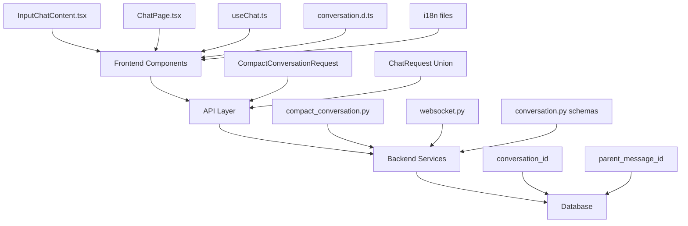

# 設計文書

## 概要

この設計書では、チャット圧縮機能に関連するすべての「Compact」用語を「Compress」に統一的に変更する包括的なリファクタリングについて詳述します。この変更は、フロントエンド、バックエンド、API、データベーススキーマ、国際化ファイルにわたって実施されます。

## アーキテクチャ

### 現在の実装構造



### 変更対象の識別

#### フロントエンド (TypeScript/React)
1. **コンポーネント**
   - `InputChatContent.tsx`: `onCompactConversation` → `onCompressConversation`
   - `ChatPage.tsx`: `compactConversation`, `onCompactConversation` → `compressConversation`, `onCompressConversation`

2. **フック**
   - `useChat.ts`: `compactConversation` → `compressConversation`

3. **型定義**
   - `@types/conversation.d.ts`: `CompactConversationRequest` → `CompressConversationRequest`

4. **国際化ファイル**
   - `i18n/en/index.ts`: `compact: 'Compact'` → `compress: 'Compress'`
   - `i18n/ja/index.ts`: `compact: '会話の圧縮'` → `compress: '会話の圧縮'`

#### バックエンド (Python/FastAPI)
1. **ファイル名**
   - `compact_conversation.py` → `compress_conversation.py`

2. **クラス・関数名**
   - `CompactConversationRequest` → `CompressConversationRequest`
   - `compact_conversation()` → `compress_conversation()`
   - `format_messages_for_compact()` → `format_messages_for_compress()`
   - `process_compact_conversation()` → `process_compress_conversation()`

3. **API エンドポイント**
   - `type: "compact_conversation"` → `type: "compress_conversation"`

## コンポーネントとインターフェース

### 1. フロントエンド型定義の変更

```typescript
// 変更前
export type CompactConversationRequest = {
  type: 'compact_conversation';
  conversationId?: string;
  model: Model;
  parentMessageId: null | string;
  botId?: string;
};

// 変更後
export type CompressConversationRequest = {
  type: 'compress_conversation';
  conversationId?: string;
  model: Model;
  parentMessageId: null | string;
  botId?: string;
};
```

### 2. バックエンドスキーマの変更

```python
# 変更前
class CompactConversationRequest(BaseSchema):
    type: Literal["compact_conversation"]
    conversation_id: str
    model: type_model_name
    parent_message_id: str | None
    bot_id: str | None = None

# 変更後
class CompressConversationRequest(BaseSchema):
    type: Literal["compress_conversation"]
    conversation_id: str
    model: type_model_name
    parent_message_id: str | None
    bot_id: str | None = None
```

### 3. React コンポーネントの変更

```typescript
// InputChatContent.tsx - 変更前
interface Props {
  onCompactConversation: () => void;
  // ...
}

// 変更後
interface Props {
  onCompressConversation: () => void;
  // ...
}
```

### 4. フック関数の変更

```typescript
// useChat.ts - 変更前
const compactConversation = (props?: {
  bot?: BotInputType;
}) => {
  const request: CompactConversationRequest = {
    type: 'compact_conversation',
    // ...
  };
};

// 変更後
const compressConversation = (props?: {
  bot?: BotInputType;
}) => {
  const request: CompressConversationRequest = {
    type: 'compress_conversation',
    // ...
  };
};
```

## データモデル

### API リクエスト/レスポンス構造

```typescript
// Union型の更新
export type ConversationRequest =
  | PostMessageRequest
  | CompressConversationRequest; // CompactConversationRequest から変更
```

```python
# Python側のUnion型更新
ChatRequest = Annotated[
    PostMessageRequest
    | CompressConversationRequest,  # CompactConversationRequest から変更
    Discriminator("type"),
]
```

### WebSocket メッセージ処理

```python
# websocket.py での処理関数名変更
def process_compress_conversation(  # process_compact_conversation から変更
    user: User,
    request: CompressConversationRequest,  # CompactConversationRequest から変更
    notificator: NotificationSender,
) -> dict:
    # ...
    compress_conversation(  # compact_conversation から変更
        user=user,
        request=request,
        # ...
    )
```

## エラーハンドリング

### 既存のエラーハンドリングの保持

- 現在の `compact_conversation` 関数のエラーハンドリングロジックは `compress_conversation` に移行
- WebSocket接続エラー、認証エラー、データベースエラーの処理は変更なし
- ログメッセージ内の「compact」文字列を「compress」に更新

### ログメッセージの更新

```python
# 変更前
print(f"compact_conversation: {request.model_dump_json()}")

# 変更後
print(f"compress_conversation: {request.model_dump_json()}")
```

## テスト戦略

### 1. 単体テスト
- `compress_conversation` 関数の動作確認
- 型定義の整合性確認
- API スキーマの検証

### 2. 統合テスト
- フロントエンドからバックエンドまでの完全なフロー確認
- WebSocket通信の正常性確認
- 既存の会話データとの互換性確認

### 3. UI テスト
- ボタンラベルの表示確認
- 多言語対応の確認
- 機能の動作確認

### 4. 回帰テスト
- 既存の会話圧縮機能が正常に動作することを確認
- パフォーマンスの劣化がないことを確認

## 国際化対応

### 翻訳ファイルの更新

```typescript
// en/index.ts
button: {
  // ...
  compress: 'Compress', // 'Compact' から変更
  // ...
}

// ja/index.ts  
button: {
  // ...
  compress: '会話の圧縮', // キーのみ変更、値は既に適切
  // ...
}
```

### 追加言語への対応
- 現在 `compact` キーが存在する他の言語ファイルも同様に `compress` に更新
- 翻訳内容は各言語で「圧縮」の適切な表現を維持

## 移行戦略

### 段階的実装アプローチ

1. **Phase 1**: バックエンドの変更
   - スキーマとファイル名の変更
   - 関数名とクラス名の変更
   - 既存APIとの後方互換性確保

2. **Phase 2**: フロントエンドの変更
   - 型定義の更新
   - コンポーネントとフックの更新
   - 国際化ファイルの更新

3. **Phase 3**: テストと検証
   - 全機能の動作確認
   - パフォーマンステスト
   - ユーザビリティテスト

### 後方互換性の考慮

- 既存の会話データは影響を受けない
- API の変更は新しいエンドポイントタイプのみ
- データベーススキーマの変更は不要

## セキュリティ考慮事項

- 認証・認可ロジックは変更なし
- 入力検証ロジックは既存のものを継承
- ログ出力における機密情報の取り扱いは現状維持

## パフォーマンス影響

- 関数名・変数名の変更のみのため、実行時パフォーマンスへの影響なし
- メモリ使用量への影響なし
- ネットワーク通信への影響なし（ペイロード構造は同一）